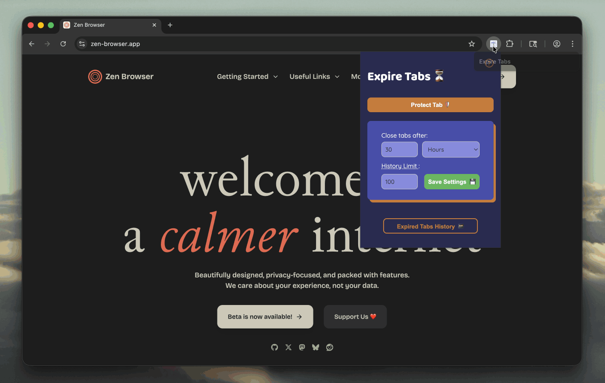

# expire-tabs

A simple browser extension (Chrome & Firefox) that closes your tabs after they have been inactive for a specified amount of time. The timer resets whenever you use/focus a tab or when the tab is pinned.

This extension was developed in part to add the "close tabs after inactivity" feature to [Zen](https://zen-browser.app) which is missing, coming from [Arc](https://arc.net).



## Features

### ⚙️ Settings (Popup)

Clicking the extension icon opens the settings popup where you can configure:

-   **Timeout**: Set the duration of inactivity after which a tab should close.
    -   Supports **Minutes**, **Hours**, and **Days**.
-   **History Limit**: Set the maximum number of expired tabs to keep in history.
    -   Set to `-1` for infinite history.
    -   Tabs exceeding the limit are removed (oldest first).
-   **View Expired Tabs**: Quick access button to open the full history page.
-   **Protect Tab**: Toggle protection for the currently active tab. Protected tabs (indicated by a 🔒 badge) will **never** be expired.

### ⌨️ Shortcuts

-   **Toggle Protection**: `Alt+Shift+P` (default) - Toggle protection for the current tab.
-   **Open Popup**: `Alt+Shift+A` (default) - Open the extension popup.
-   **Open History**: `Alt+Shift+H` (default) - Open the history (options) page.
-   **Customize**: You can change these shortcuts in your browser's extension shortcuts settings (`chrome://extensions/shortcuts`).

### 📜 History (Options Page)

The options page provides a dashboard for your expired tabs:

-   **Search**: Filter history by Title or URL. Multiple terms are treated as "AND" conditions (e.g., "git issue" matches items containing both "git" and "issue").
-   **Copy URL**: One-click button to copy the expired tab's URL to your clipboard.
-   **Delete**: Remove individual items from your history.
-   **Clear History**: Wipe all recorded history.

### 🧠 Background Behavior

-   The extension uses a background service worker to monitor tab activity.
-   It uses `chrome.alarms` to check for expired tabs every minute to minimize resource usage.
-   **Pinned tabs** and tabs **playing audio** are automatically protected and will **not** be closed.

## Development

This project supports both Chrome and Firefox. It is mainly vibe-coded because I don't have enough time.

### Build

To build the extension for both Chrome and Firefox:

```bash
npm run build
```

Using Rollup, this will:

1. Compile the JS bundles.
2. Build the full extension (`src/dist/chrome` and `src/dist/firefox`) using [Extension.js](https://extension.js.org)

### Watch

To start the development server and watch for changes (including HTML/CSS):

```bash
npm run watch # builds when src files or manifest change
```

### Testing

Run unit and E2E tests with:

```bash
# `npm run build` is run automatically before testing
npm test # all tests
npm run test:glob test/storage.test.mjs # specific test
npm run test:glob test/*_*.mjs # multiple specific tests
```
